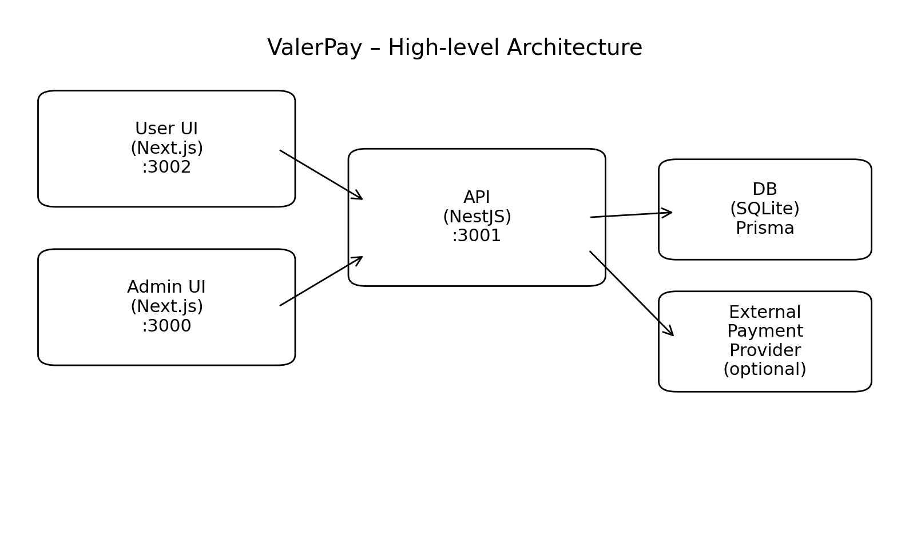
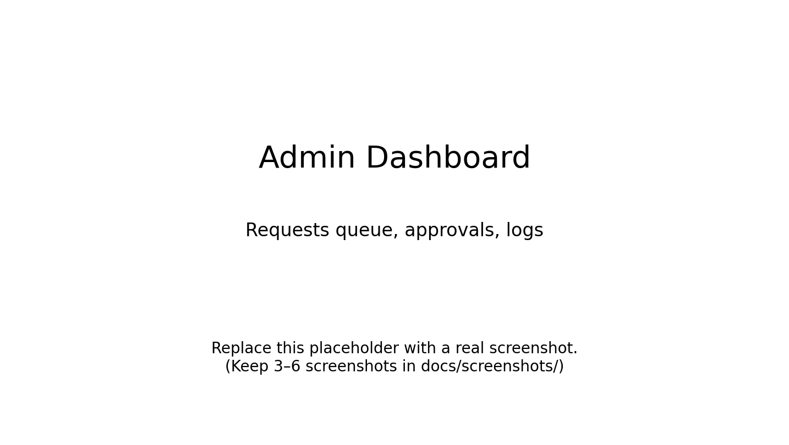
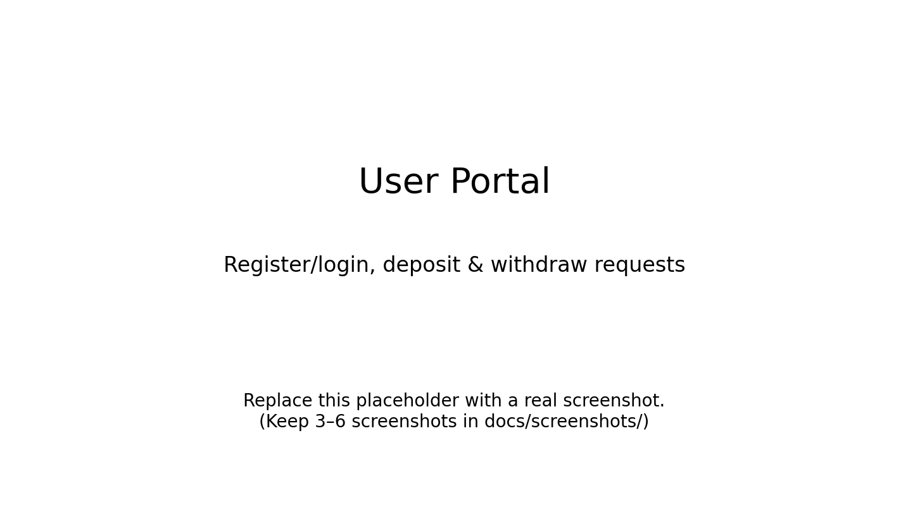
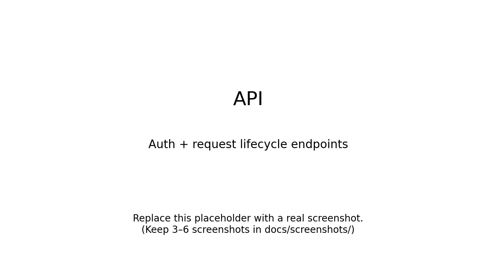

# ValerPay

**ValerPay** is a full‑stack demo payment platform that models a real-world workflow: users create **deposit/withdraw** requests, and admins **review/approve/complete** them. Balances are derived from a **ledger** (DEBIT/CREDIT) instead of storing a mutable “balance” number.

<p align="center">
  
</p>

## Demo (local)
- API: `http://localhost:3001`
- Admin UI: `http://localhost:3000`
- User UI: `http://localhost:3002`

> Replace placeholders in `docs/screenshots/` with real screenshots from your UI before final submission.

## Key features
- **Role-based access** (USER / ADMIN) with JWT
- User flows: **register/login**, create **deposit/withdraw** requests, view **requests & balance**
- Admin flows: **claim**, **approve/reject**, **send**, **complete** requests
- **Payment configuration** flags (enable/disable deposits & withdraws per method)
- **Ledger-driven balance** computation (audit-friendly)
- **Audit logs** & basic operational reporting (`/admin/reports/daily`)
- Prisma migrations + seed for consistent reviewer setup

## Tech stack
- **Backend:** NestJS, Prisma, TypeScript, JWT, Jest
- **Database (local/demo):** SQLite (schema + migrations versioned)
- **Frontend:** Next.js (Admin + User apps), TypeScript
- **Quality:** ESLint, GitHub Actions CI

## Quickstart (local)
### 1) Prerequisites
- Node.js (LTS recommended)

### 2) Install deps (per app)
```bash
# backend
cd src/backend
npm install

# admin UI
cd ../frontend/admin
npm install

# user UI
cd ../user
npm install
```

### 3) Environment variables
Copy the template and create per-app env files:
```bash
cp .env.example src/backend/.env
cp .env.example src/frontend/admin/.env.local
cp .env.example src/frontend/user/.env.local
```

### 4) Init database (backend)
```bash
cd src/backend
npx prisma migrate dev
npx prisma db seed
```

### 5) Run
```bash
# terminal 1
cd src/backend
npm run start:dev

# terminal 2
cd src/frontend/admin
npm run dev -- -p 3000

# terminal 3
cd src/frontend/user
npm run dev -- -p 3002
```

## Screenshots
<p>
  
  
  
</p>

## API docs
See: **`docs/api.md`**

## Project structure
```
ValerPay/
  docs/
    architecture.png
    api.md
    decisions.md
    screenshots/
  src/
    backend/                 # NestJS API + Prisma
    frontend/
      admin/                 # Next.js Admin UI
      user/                  # Next.js User UI
  tests/                     # Pointers to test locations
  .github/workflows/ci.yml   # CI pipeline
```

## Roadmap
- Swagger/OpenAPI docs and versioned contract
- End-to-end smoke test in CI with seeded DB
- Frontend unit/component tests
- Optional Docker compose for full local stack

## AI assistance
This project was developed with AI assistance (ChatGPT) for brainstorming, refactoring suggestions, and debugging support. Final implementation, integration decisions, and testing were done by me.

**What I did myself**
- Designed the domain workflow (roles, request lifecycle, admin operations) and implemented it end-to-end.
- Implemented Prisma schema + migrations and integrated it into the NestJS service layer.
- Wired the frontends to the API and structured the repository for reviewer-friendly setup (docs/tests/CI).

## License
MIT — see `LICENSE`.
