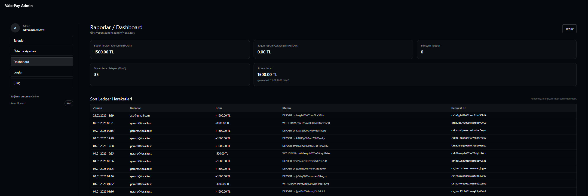
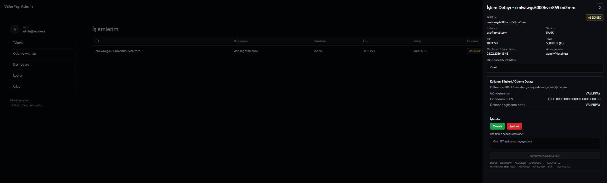
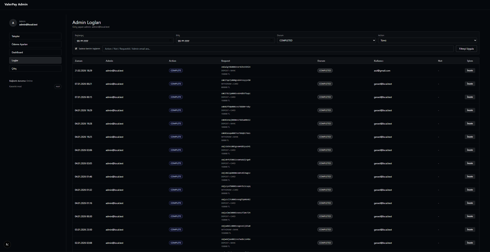
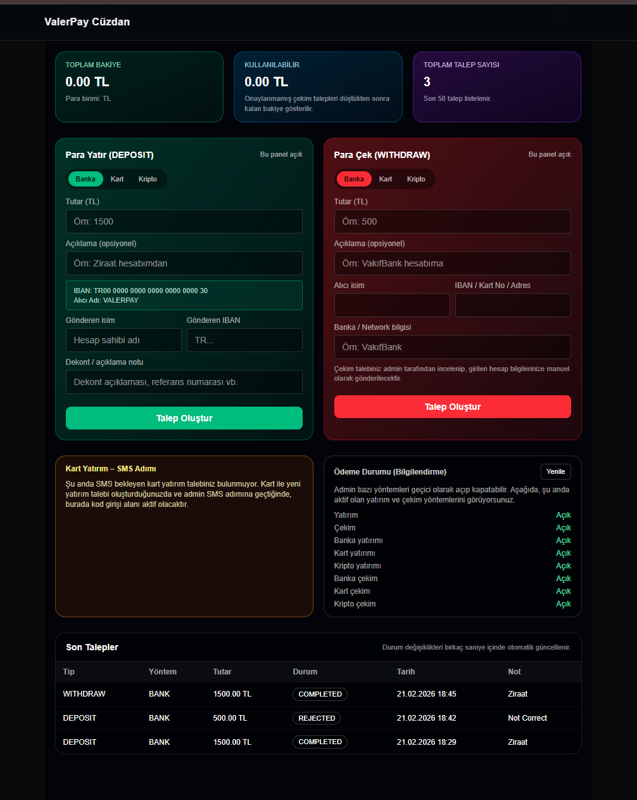
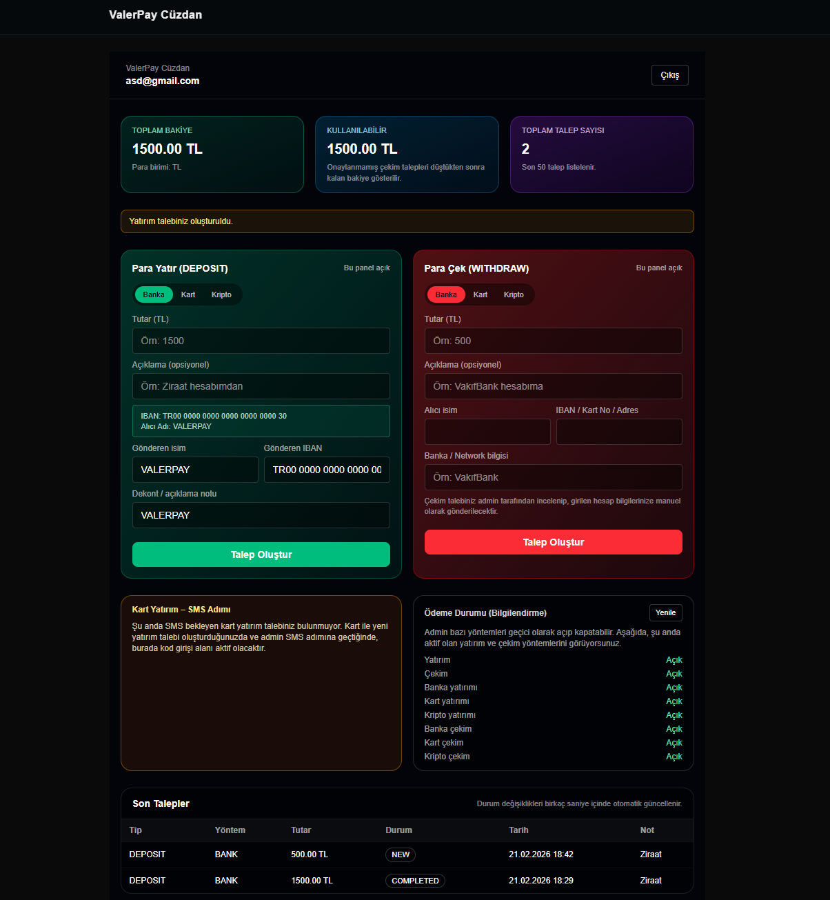
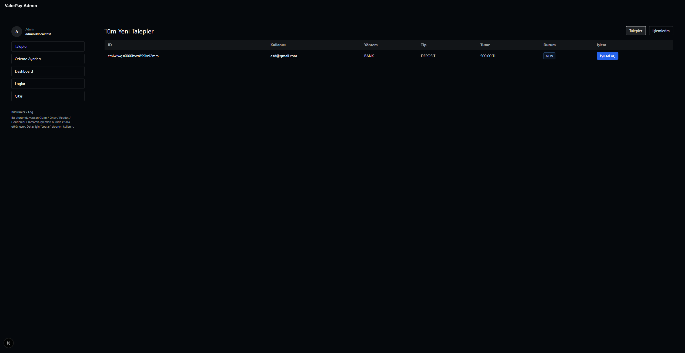
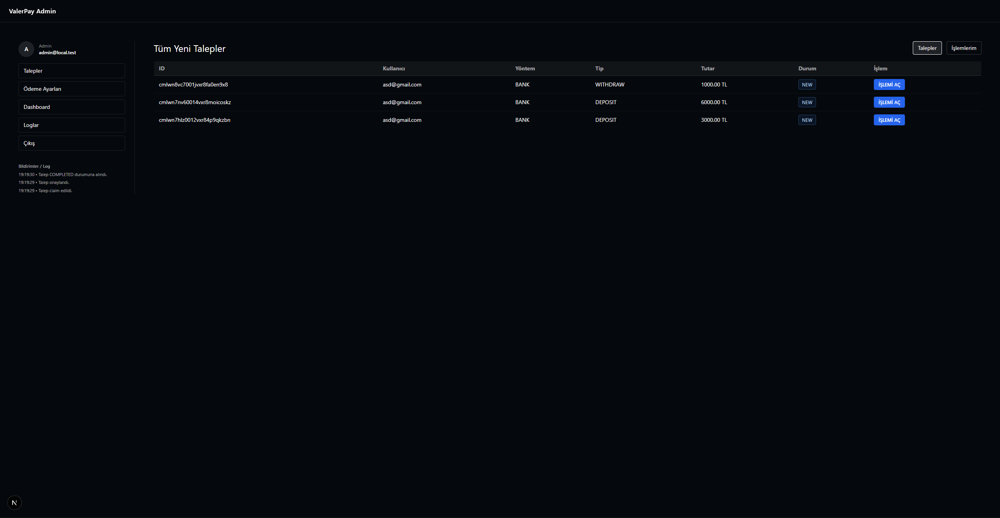
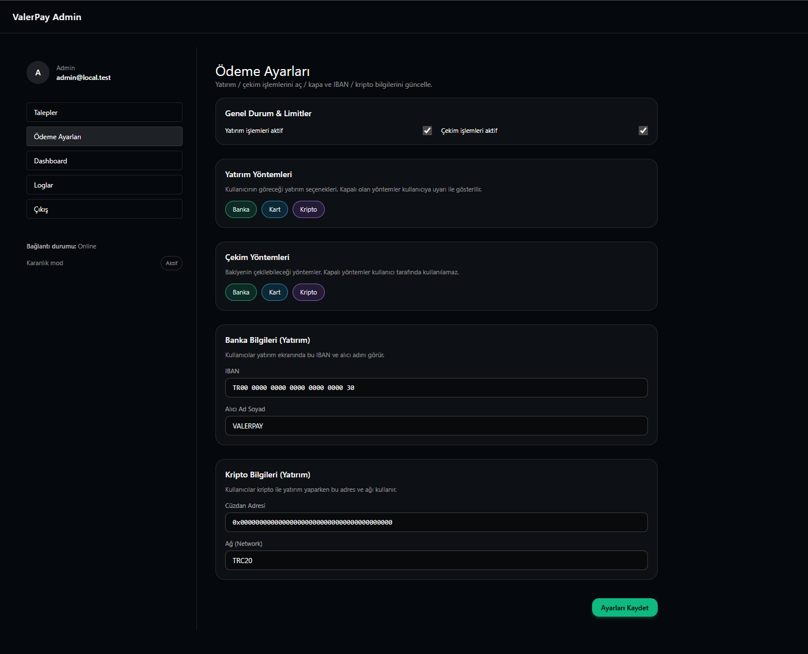

# ValerPay

[](../../actions/workflows/ci.yml)
[](./LICENSE)

**ValerPay** is a workflow-integrity and auditability demo built around ledger-based balances, role separation, admin review flow, and controlled state transitions.

Rather than presenting itself as a production fintech product, the project is intentionally framed as a reviewable systems demo that shows how authorization, request lifecycle control, audit visibility, and predictable business logic can be designed in a full-stack application.

<p align="center">
  
</p>

---

## Table of contents
- [Why this project matters](#why-this-project-matters)
- [Why ledger-based balances?](#why-ledger-based-balances)
- [Role / permission matrix](#role--permission-matrix)
- [Key capabilities](#key-capabilities)
- [Request lifecycle](#request-lifecycle)
- [Failure cases handled](#failure-cases-handled)
- [Screenshots](#screenshots)
- [Tech stack](#tech-stack)
- [Quality & CI](#quality--ci)
- [Quickstart (local)](#quickstart-local)
- [Environment variables](#environment-variables)
- [Seeded demo accounts](#seeded-demo-accounts)
- [API quick reference](#api-quick-reference)
- [Project structure](#project-structure)
- [Roadmap](#roadmap)
- [AI assistance](#ai-assistance)
- [License](#license)

---

## Why this project matters

This project was built to show more than CRUD screens or payment-themed UI.

The main goal is to demonstrate:
- ledger-based balance calculation instead of mutable balance storage
- controlled workflow transitions with clear admin responsibility
- role separation between user and admin actions
- audit-friendly visibility into requests, logs, and ledger entries
- predictable business behavior under review, approval, rejection, and completion flows

In other words, ValerPay should read as a system-design and integrity demo first, and as a payment-flavored app second.

---

## Why ledger-based balances?

Many demos store a mutable `balance` number, which can become inconsistent under retries, concurrency, partial failures, or incorrect state handling.

ValerPay uses an **append-only ledger**:
- every money movement is recorded as immutable **DEBIT/CREDIT** entries
- the visible balance is **derived** by summing ledger lines
- audit trails remain easier to inspect and reason about
- reconciliation is simpler than with direct balance mutation

This design makes the system more traceable, more reviewable, and less dependent on hidden state changes.

---

## Role / permission matrix

| Role | Main permissions |
|---|---|
| User | Register and log in, create deposit/withdraw requests, view own requests, view derived balance, view own activity through the user-facing workflow |
| Admin | Log in through the admin flow, review requests, claim requests, approve or reject requests, mark requests as sent or completed, view audit logs, inspect ledger entries, access operational dashboards |
| Super Admin | Inherits admin-level visibility and actions, plus higher-level configuration control such as payment settings and privileged operational review in the local demo environment |

This matrix makes role separation visible to reviewers without requiring them to infer it from routes alone.

---

## Key capabilities

### Authentication and roles
- role-based access with JWT
- separate login flows for users and admins
- admin-only actions protected by role checks
- local seeded accounts for fast reviewer setup

### User-facing workflow
- register / login
- create deposit and withdraw requests
- view request history
- view derived balance instead of a mutable stored balance

### Admin-facing workflow
- review incoming requests
- claim requests to self
- approve / reject requests
- mark approved requests as sent / completed
- inspect audit logs
- inspect ledger entries
- use daily reporting / operational views

### Integrity and safety
- append-only ledger model
- input validation
- controlled request status transitions
- configuration flags for payment method availability
- versioned database schema and migrations with Prisma

---

## Request lifecycle

High-level request statuses:
- `NEW` → `ASSIGNED` → `APPROVED` → `SENT` → `COMPLETED`
- `NEW` / `ASSIGNED` → `REJECTED`

Important constraints:
- only admins can change request status
- request completion is tied to ledger entry creation
- the audit trail remains available across status changes
- state transitions are intentionally constrained rather than loosely editable

---

## Failure cases handled

This project intentionally treats invalid or unsafe workflow behavior as part of the system design.

Examples of handled cases include:
- unauthorized users cannot access admin-only operations
- invalid request state transitions are blocked instead of silently accepted
- ledger creation is tied to the intended workflow stage rather than arbitrary balance mutation
- request review actions remain role-restricted
- payment availability can be disabled through configuration flags
- audit visibility remains available for operational review
- seeded demo credentials are clearly marked as local-only and not production credentials

This section is included to show that the project is not only about the happy path, but also about keeping workflow behavior controlled and reviewable.

---

## Screenshots

### Highlights
<p>
  
  
  
</p>

<p>
  
  
  
</p>

### More screenshots (optional)
<details>
  <summary><b>Click to expand</b></summary>

  <p>
    
    
  </p>
</details>

---

## Tech stack

- **Backend:** NestJS, Prisma, TypeScript, JWT, Jest
- **Database (local/demo):** SQLite
- **Frontend:** Next.js (Admin + User UIs), TypeScript
- **Quality:** ESLint, GitHub Actions CI

---

## Quality & CI

CI runs on every push / PR:
- `npm run lint`
- `npm run build`
- `npm test`

Local quality commands:
```bash
npm run lint
npm run build
npm test
```

---

## Quickstart (local)

### 1) Prerequisites
- Node.js (LTS recommended)
- (Optional) Git

### 2) Install dependencies
From the repo root:
```bash
npm install
```

### 3) Create env files
```bash
cp .env.example src/backend/.env
cp .env.example src/frontend/admin/.env.local
cp .env.example src/frontend/user/.env.local
```

### 4) Configure backend env
Open `src/backend/.env` and set:
```bash
DATABASE_URL="file:./dev.db"
JWT_SECRET="change_me_to_any_long_string"
PORT=3001
CORS_ORIGINS="http://localhost:3000,http://localhost:3002"
NEXT_PUBLIC_API_URL="http://localhost:3001"
```

### 5) Initialize database
```bash
npm --workspace src/backend run db:migrate
npm --workspace src/backend run db:seed
```

### 6) Run the apps
Terminal 1 (API):
```bash
npm run dev:backend
```

Terminal 2 (Admin UI):
```bash
npm run dev:admin
```

Terminal 3 (User UI):
```bash
npm run dev:user
```

### 7) Sanity check
- Admin UI: `http://localhost:3000`
- User UI: `http://localhost:3002`
- API base: `http://localhost:3001`

---

## Environment variables

Template file: `.env.example`

### Backend (NestJS + Prisma)
- `DATABASE_URL` — SQLite demo example: `file:./dev.db`
- `JWT_SECRET` — any long random string for local demo
- `PORT` — API port (default `3001`)
- `CORS_ORIGINS` — comma-separated allowed origins for Admin + User UIs

### Frontend (Next.js Admin / User)
- `NEXT_PUBLIC_API_URL` — API base URL used by both frontends

> Security note: never commit real secrets. `.env` files must stay local.

---

## Seeded demo accounts

For reviewer-friendly setup, the seed creates demo users and admins.

### Admin
- `admin@local.test` / `Admin123!` (role: ADMIN)
- `root@local.test` / `Root123!` (role: SUPER_ADMIN)

### User
- `gerard@local.test` / `User123!`

> These credentials exist for local/demo review only.

---

## API quick reference

Base URL (local): `http://localhost:3001`  
Auth header: `Authorization: Bearer <JWT>`

### Auth
- `POST /auth/user/register`
- `POST /auth/user/login`
- `POST /auth/admin/login`

### User (requires USER JWT)
- `GET /user/me`
- `GET /user/config/payments`
- `GET /user/balance`
- `GET /user/requests`
- `POST /user/requests/deposit`
- `POST /user/requests/withdraw`

### Admin (requires ADMIN JWT)
- `GET /admin/config/payments`
- `POST /admin/config/payments`
- `GET /admin/requests`
- `GET /admin/requests/:id`
- `POST /admin/requests/:id/claim`
- `POST /admin/requests/:id/approve`
- `POST /admin/requests/:id/reject`
- `POST /admin/requests/:id/send`
- `POST /admin/requests/:id/request-sms`
- `POST /admin/requests/:id/complete`
- `POST /admin/users/:email/requests/withdraw`
- `GET /admin/logs`
- `GET /admin/ledger/entries`
- `GET /admin/reports/daily`

Full endpoint details: `docs/api.md`

---

## Project structure

```txt
ValerPay/
  .github/workflows/ci.yml      # CI pipeline (lint/build/test)
  docs/
    architecture.png
    api.md
    decisions.md
    screenshots/
  src/
    backend/                    # NestJS API + Prisma
    frontend/
      admin/                    # Next.js Admin UI
      user/                     # Next.js User UI
  tests/                        # Test pointers / shared fixtures
  .env.example
  README.md
  LICENSE
  CHANGELOG.md
  CONTRIBUTING.md
  SECURITY.md
```

---

## Roadmap

### Next version goals
- add a short threat-model note for admin workflow and request lifecycle abuse cases
- add filtered audit-log views and export-oriented review improvements
- add end-to-end smoke coverage for core request transitions
- expand seeded demo scenarios to include more operational edge cases
- add a short architecture decision note explaining JWT, ledger derivation, and transition constraints in one place

### Longer-term improvements
- Swagger / OpenAPI docs for a versioned contract
- frontend unit / component tests
- optional Docker Compose setup for a faster local stack

---

## AI assistance

This project was developed with AI assistance for brainstorming, refactoring suggestions, and debugging support. Final implementation, integration decisions, and testing were completed by me.

### What I did myself
- designed the domain workflow, roles, and request lifecycle
- implemented Prisma schema, migrations, seed logic, and NestJS service integration
- wired the frontends to the API
- structured the repo for reviewer-friendly setup with docs, tests, and CI

---

## License

MIT — see `LICENSE`.
