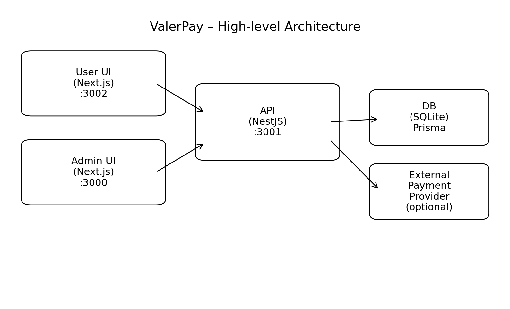

# ValerPay

[](../../actions/workflows/ci.yml)
[](./LICENSE)

**ValerPay** is a workflow-oriented demo payment platform built to model a realistic operational flow: users create **deposit** and **withdraw** requests, and admins **review → approve/reject → send → complete** them.

The project’s most important design choice is that balances are **not** stored as a mutable number. Instead, they are derived from an **append-only ledger** built from immutable **DEBIT/CREDIT** entries.

This repo is meant to show more than a generic full-stack demo. It is built to highlight:

- **workflow integrity**
- **role separation**
- **audit-friendly state transitions**
- **predictable backend behavior**
- **reviewable documentation and setup**



---

## Table of contents

- [Why this project matters](#why-this-project-matters)
- [What this repo demonstrates](#what-this-repo-demonstrates)
- [Why ledger-based balances?](#why-ledger-based-balances)
- [Key features](#key-features)
- [Request lifecycle](#request-lifecycle)
- [Tech stack](#tech-stack)
- [Reviewer quickstart](#reviewer-quickstart)
- [Environment variables](#environment-variables)
- [Seeded demo accounts](#seeded-demo-accounts)
- [API quick reference](#api-quick-reference)
- [Documentation and project structure](#documentation-and-project-structure)
- [Known limitations](#known-limitations)
- [Next version goals](#next-version-goals)
- [AI assistance](#ai-assistance)
- [License](#license)

---

## Why this project matters

Many demo payment apps focus on UI or basic CRUD, but real systems are usually judged by whether their workflows remain consistent, traceable, and reviewable when multiple roles interact with the same request.

ValerPay is intentionally framed around that problem.

It treats the request lifecycle, admin actions, ledger derivation, and audit visibility as first-class concerns instead of background details.

---

## What this repo demonstrates

- a full-stack workflow with separate **user** and **admin** responsibilities
- backend-driven request transitions with controlled state changes
- **ledger-based** balance derivation instead of a mutable balance field
- operational visibility through **logs**, **reports**, and **reviewable business logic**
- repo hygiene through docs, tests, CI, changelog, and security notes

---

## Demo (local)

- **API:** `http://localhost:3001`
- **Admin UI:** `http://localhost:3000`
- **User UI:** `http://localhost:3002`

---

## Why ledger-based balances?

Most demos store a mutable `balance` number, which can become inconsistent under retries, partial failures, or poor state handling.

ValerPay uses an **append-only ledger** instead:

- every money movement is recorded as immutable **ledger lines** (`DEBIT` / `CREDIT`)
- the current balance is **derived** by summing those ledger lines
- this makes the workflow more **deterministic**, **traceable**, and easier to reconcile

This is one of the clearest engineering signals in the project because it shows that balance integrity was treated as a design decision, not only a display value.

---

## Key features

### Authentication and roles
- role-based access with **USER**, **ADMIN**, and **SUPER_ADMIN** behavior
- separate login flows for user and admin contexts
- JWT-based authentication for protected routes

### User flows
- register / login
- create **deposit** and **withdraw** requests
- review personal requests and derived balance

### Admin flows
- review requests
- claim requests
- approve / reject
- send / complete
- inspect logs and ledger data
- access daily operational reporting

### Integrity and operational controls
- append-only ledger model
- input validation and controlled status transitions
- request lifecycle logic kept in the backend service layer
- versioned schema and migrations through Prisma
- CI, tests, changelog, and security policy files included in the repo

---

## Request lifecycle

### High-level request statuses

- `NEW` → `ASSIGNED` → `APPROVED` → `SENT` → `COMPLETED`
- `NEW/ASSIGNED` → `REJECTED`

### Important workflow notes

- only admins can change request states
- request progression is explicit, not hidden in UI-only logic
- ledger entry creation is tied to request completion so the audit trail remains intact

---

## Security and integrity decisions

This repo is not presented as a complete fintech security platform. It is presented as a **workflow-integrity demo** with practical security-aware choices:

- **role separation** is enforced between user and admin capabilities
- **audit visibility** exists through logs, reports, and traceable request history
- **state transitions** are controlled so request handling stays predictable
- the **ledger model** reduces risk from inconsistent balance mutation
- configuration, migrations, and seeds are versioned for reviewer-friendly reproducibility

---

## Tech stack

- **Backend:** NestJS, Prisma, TypeScript, JWT, Jest
- **Database (local/demo):** SQLite
- **Frontend:** Next.js (Admin + User apps), TypeScript
- **Quality:** ESLint, GitHub Actions CI

---

## Reviewer quickstart

### 1) Prerequisites
- Node.js (LTS recommended)
- Git (optional)

### 2) Install dependencies

```bash
npm install
```

### 3) Create env files

```bash
cp .env.example src/backend/.env
cp .env.example src/frontend/admin/.env.local
cp .env.example src/frontend/user/.env.local
```

### 4) Configure the database

Open `src/backend/.env` and set:

```bash
DATABASE_URL="file:./dev.db"
JWT_SECRET="change_me_to_any_long_string"
PORT=3001
CORS_ORIGINS="http://localhost:3000,http://localhost:3002"
NEXT_PUBLIC_API_URL="http://localhost:3001"
```

### 5) Initialize the database

```bash
npm --workspace src/backend run db:migrate
npm --workspace src/backend run db:seed
```

### 6) Run the apps

```bash
npm run dev:backend
npm run dev:admin
npm run dev:user
```

### 7) Sanity check

- open Admin UI: `http://localhost:3000`
- open User UI: `http://localhost:3002`
- open API base: `http://localhost:3001`

---

## Environment variables

Template file: `.env.example`

### Backend (NestJS + Prisma)
- `DATABASE_URL` — SQLite demo example: `file:./dev.db`
- `JWT_SECRET` — any long random string for local demo
- `PORT` — API port (default `3001`)
- `CORS_ORIGINS` — comma-separated allowed origins

### Frontend (Next.js Admin/User)
- `NEXT_PUBLIC_API_URL` — API base URL used by both frontends

> Security note: never commit real secrets. `.env` files must stay local.

---

## Seeded demo accounts

### Admin
- `admin@local.test` / `Admin123!`
- `root@local.test` / `Root123!`

### User
- `gerard@local.test` / `User123!`

> These credentials are for local/demo only.

---

## API quick reference

Base URL (local): `http://localhost:3001`

Auth header:

```text
Authorization: Bearer <token>
```

### Auth
- `POST /auth/user/register`
- `POST /auth/user/login`
- `POST /auth/admin/login`

### User (requires USER JWT)
- `GET /user/me`
- `GET /user/config/payments`
- `GET /user/balance`
- `GET /user/requests`
- `POST /user/requests/deposit`
- `POST /user/requests/withdraw`

### Admin (requires ADMIN JWT)
- `GET /admin/config/payments`
- `POST /admin/config/payments`
- `GET /admin/requests`
- `GET /admin/requests/:id`
- `POST /admin/requests/:id/claim`
- `POST /admin/requests/:id/approve`
- `POST /admin/requests/:id/reject`
- `POST /admin/requests/:id/send`
- `POST /admin/requests/:id/request-sms`
- `POST /admin/requests/:id/complete`
- `POST /admin/users/:email/requests/withdraw`
- `GET /admin/logs`
- `GET /admin/ledger/entries`
- `GET /admin/reports/daily`

Full details: [`docs/api.md`](docs/api.md)

---

## Documentation and project structure

### Main documentation
- [`docs/api.md`](docs/api.md)
- [`docs/decisions.md`](docs/decisions.md)
- `docs/screenshots/`
- [`CHANGELOG.md`](CHANGELOG.md)
- [`SECURITY.md`](SECURITY.md)

### Project structure

```text
ValerPay/
├─ .github/workflows/ci.yml      # CI pipeline (lint / build / test)
├─ docs/
│  ├─ architecture.png
│  ├─ api.md
│  ├─ decisions.md
│  └─ screenshots/
├─ src/
│  ├─ backend/                   # NestJS API + Prisma
│  └─ frontend/
│     ├─ admin/                  # Next.js Admin UI
│     └─ user/                   # Next.js User UI
├─ tests/
├─ .env.example
├─ README.md
├─ CHANGELOG.md
├─ CONTRIBUTING.md
├─ SECURITY.md
└─ LICENSE
```

---

## Screenshots

The screenshot set is intentionally kept in the repository so a reviewer can quickly inspect:

- admin dashboard behavior
- request detail flow
- user portal and request creation
- ledger entries and daily reporting
- authentication and payment configuration views

See `docs/screenshots/` for the image set.

---

## Quality and CI

CI runs on every push / PR:

- `npm run lint`
- `npm run build`
- `npm test`

Local quality commands:

```bash
npm run lint
npm run build
npm test
```

---

## Known limitations

- this is a demo system, not a production financial platform
- SQLite is used for local/demo simplicity
- there is no full external payment-provider integration in the current version
- frontend test coverage is lighter than the backend/service-side logic
- documentation and reviewer setup are stronger than deployment hardening in the current scope

---

## Next version goals

- add versioned Swagger / OpenAPI documentation
- add end-to-end smoke tests in CI with a seeded database
- expand frontend test coverage
- add Docker Compose for one-command local setup
- add richer reporting / admin review utilities
- document more failure-case handling around request processing and reconciliation

---

## AI assistance

This project was developed with AI assistance (ChatGPT) for brainstorming, refactoring suggestions, and debugging support.

Final implementation, integration decisions, and testing were done by me.

### What I did myself

- designed the domain workflow (roles, request lifecycle, admin operations)
- implemented the Prisma schema, migrations, and seed flow
- integrated the NestJS service layer with the frontends
- structured the repository for reviewer-friendly setup with docs, tests, CI, and security notes

---

## License

MIT — see [`LICENSE`](LICENSE).
